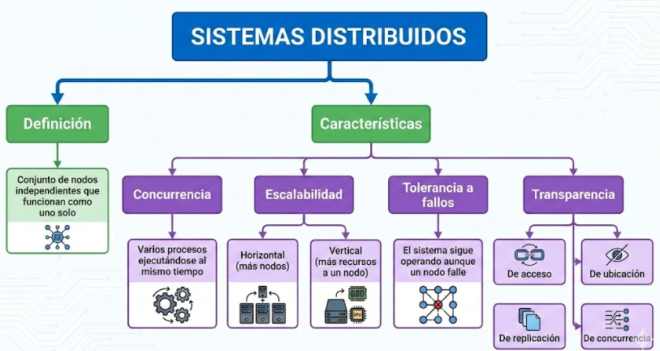

# Sistemas Distribuidos — Unidad 1  
## Actividad práctica — Tema 1: Introducción a sistemas distribuidos y curso  

Juan Sebastian Agudelo Quintero

## 1. Revisión conceptual  

### ¿Qué es un sistema distribuido?

Un sistema distribuido es cuando varias computadoras trabajan juntas por medio de una red, pero para el usuario parecen ser un solo sistema. Aunque por detrás hay muchos equipos compartiendo información y tareas, uno como usuario solo ve un servicio funcionando de forma normal y continua.

Es básicamente un conjunto de máquinas independientes que cooperan para lograr un mismo objetivo, compartiendo recursos y procesando información al mismo tiempo.

---

### Diferencias entre sistema centralizado y distribuido

#### Sistema centralizado
- Todo depende de un solo servidor o equipo principal.  
- Si ese equipo falla, todo el sistema deja de funcionar.  
- Es más simple de administrar.  
- Tiene límites claros de capacidad (depende de un solo nodo).  

#### Sistema distribuido
- Está compuesto por varios nodos conectados en red.  
- Si uno falla, los demás pueden seguir funcionando (tolerancia a fallos).  
- Permite crecer agregando más nodos (escalabilidad horizontal).  
- Maneja múltiples procesos al mismo tiempo (concurrencia).  
- Para el usuario parece un solo sistema (transparencia).  

---

## 2. Ejemplo aplicado  

### Ejemplo: Netflix  

Netflix es un sistema distribuido porque no funciona desde un solo servidor. Tiene miles de servidores ubicados en diferentes partes del mundo.

#### ¿Cómo funciona?
- Cuando un usuario reproduce una película, la solicitud viaja por internet.  
- Se dirige al servidor más cercano a su ubicación.  
- El contenido está replicado en varios servidores.  
- Si uno falla, otro puede responder la solicitud.  

#### ¿Por qué necesita estar distribuido?
- Tiene millones de usuarios conectados al mismo tiempo (concurrencia).  
- Necesita escalar constantemente agregando más servidores (escalabilidad).  
- Debe seguir funcionando incluso si un servidor falla (tolerancia a fallos).  
- El usuario no debe notar dónde está realmente almacenado el contenido (transparencia).  

Si fuera centralizado, colapsaría fácilmente por la cantidad de usuarios.

---

## 3. Mapa conceptual  

## 4. Reflexión crítica  

Aprender sobre sistemas distribuidos impactará mi futuro como desarrollador porque hoy en día casi todas las aplicaciones modernas funcionan en la nube y están basadas en arquitecturas distribuidas.

Entender conceptos como escalabilidad, tolerancia a fallos y concurrencia me permitirá diseñar sistemas más robustos, capaces de soportar muchos usuarios y de seguir funcionando incluso cuando ocurren errores.

Además, ya no basta con saber programar; también es necesario saber diseñar la arquitectura del sistema. Los sistemas distribuidos son la base de microservicios, cloud computing y aplicaciones empresariales modernas, por lo que dominar estos temas me dará una ventaja profesional importante.